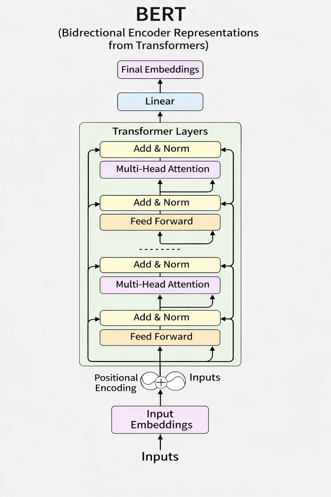
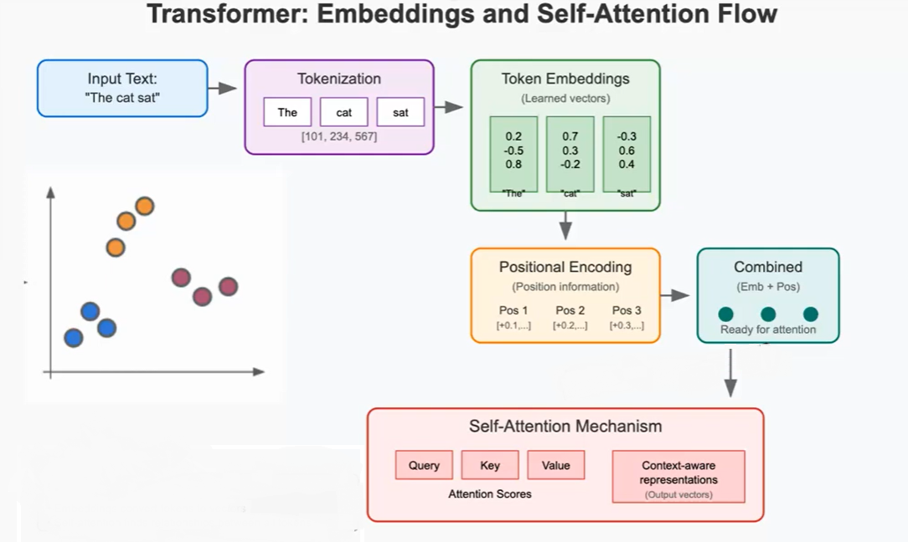
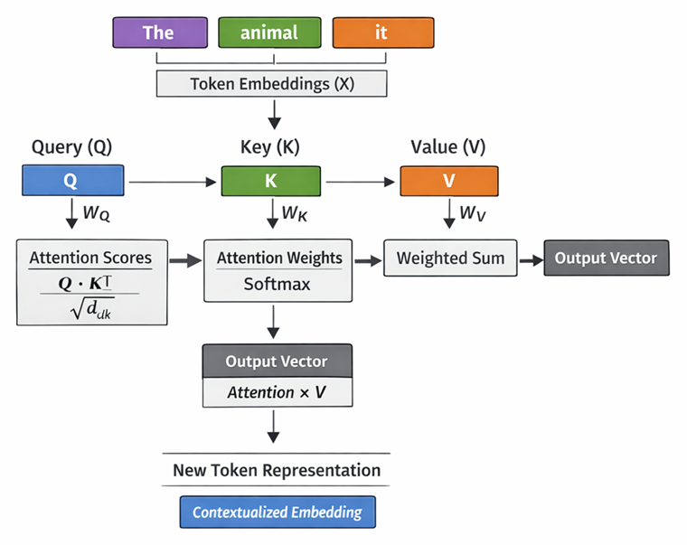

<cneter></cneter>

# Fine tuning with Bert Transformer

Fine-tuning is the process of training a Large Language Model (LLM) such as LLAMA, BERT, or ChatGPT on a specialized domain or task. These models begin as pre trained models, meaning they have already learned general language patterns from large datasets. After pre training, we can fine tune a model on a smaller, domain specific dataset to adapt it for a particular application. For example, we can take a base model like BERT and fine-tune it for a targeted task or specialized area.

In this article, we will focus on the BERT model, a widely used pre trained Transformer model. We will examine its architecture in detail and compare BERT with other models such as LLAMA and ChatGPT.

BERT’s key architectural feature is its bidirectionality, which comes from the self-attention layers within its Transformer blocks. Unlike traditional models such as GPT, where attention is unidirectional (tokens attend only left to right), BERT’s self attention allows each token to attend to all other tokens in the input sequence both left and right. BERT is primarily a Seq2Vector model, whereas ChatGPT is a Seq2Seq model. This article will also explore Seq2Vector behavior in depth.

BERT was introduced by the Google research team in 2018. Its development follows a two-stage process: (1) pre-training on large unlabeled datasets, and (2) fine tuning on smaller, task-specific datasets. In this article, we will focus on the pre-trained BERT model and then apply fine-tuning techniques to structured data for three tasks: data completeness checks, data classification, and data clustering.

While these tasks can be performed using traditional machine-learning methods, BERT provides significant advantages when structured datasets contain text fields, sentences, or multiple languages. In such cases, BERT’s language-understanding capabilities offer important benefits in model performance and flexibility.

BERT (Bidirectional Encoder Representations from Transformers) is a pre-trained language model developed by Google in 2018.

## I.  The Architecture diagram of BERT model 

<!--
 -->
Before diving into fine tuning, we have to understand the archtecture diagram for Bert.

According to the diagram above, BERT has different layers like encoding, attention and classification layers

#### 1. Input Layer

The input is tokenized text, broken into tokens (words, sub words, or characters)

#### 2. Encoding Layer

This layer transforms the input tokens into dense vector representations (embeddings). After the encoding, we should specify the position for each token. After that we have to combine the the embeding with position

Please check the diagram below:

#### 3. Transformer blocks
A. Attention and multi-attention layer

- Attention Layer (Self-Attention)
Each word attends to (looks at) all other words in the sentence to understand context. 

Why we call it Self-Attention: Queries, Keys, and Values all come from the same sentence and each word attends to other words in itself

In Scaled Dot-Product Attention (the core inside MHA), the attention weights are computed. By using three values Q, K and V
See this example. In real life the three values with have matrix to calculate the weight. 

Q (Query): “What am I looking for?”

K (Key): “What features do you have?”

V (Value): “What content should I propagate based on attention?”

Intuitively: the query asks a question, the keys provide context, and the values provide the actual information to mix.

In the example below explain more:

- Multi-attention
In Bert each self-Attension is header. Bert can run many headers in parallel.   

#### B. Residual + LayerNorm

Residual (add) connections:

The core problem: why gradients struggle in deep networks. In very deep models (like Transformers with 12–96 layers):
Gradients are computed using backpropagation. Each layer multiplies gradients by weights and derivatives

To solve this issue, we will do the following steps:

1- Group the layers to Block. The block contains many layers
2- We create to paths First path is regulare path way or longer pathway Second one is short cut pathway (skip connections)
3- The input in each block is the addtion of short cut pathway and long pathway (Addition math or concat). Math is better because in concat, the size of layer will change. In the transfoermer, we use math addition

Advantage:
1- Better Gradian flow
2- Faster Learner 
3- Enables deeper learners

<cneter></cneter>

After multi-head attention, Residual + LayerNorm starts. 
Residual: Adds the original input XXX to the MHA output.
LayerNorm: Normalizes the sum for stable training.

#### 4. Transformer Blocks (Stacked Layers)

BERT has 12 transformer blocks in BERT-Base, and 24 in BERT-Large.

#### 5. Classification Layer (Task-specific Head)

On top of BERT, a simple dense layer is added for downstream tasks.
Example:
For sentiment classification, it predicts positive/negative.
For question answering, it predicts start and end tokens of the answer.
Uses the special [CLS] token representation for classification.

#### 6. Output Layer

Final prediction based on the task:
Class probabilities (e.g., positive vs. negative sentiment),
Answer spans (start/end positions in QA),
Next sentence prediction (original pretraining objective).

## II. Transformer blocks in BERT

Bert transformation contains 6,12, 24 Transformer blocks depending  on the type of BERT such as DistilBERT , BERT Base and BERT Large.

<cneter></cneter>

The transformer block contains of two parts in each transformer block.

<b>The first part is attention head (multi-head attentions)</b> 
In Scaled Dot-Product Attention (the core inside MHA), the attention weights are computed. By using three values Q, K and V
See this example. In real life the three values with have matrix to calculate the weight. 

Q (Query): “What am I looking for?”

K (Key): “What features do you have?”

V (Value): “What content should I propagate based on attention?”

Intuitively: the query asks a question, the keys provide context, and the values provide the actual information to mix.

After multi-head attention, Residual + LayerNorm starts. 
Residual: Adds the original input XXX to the MHA output.
LayerNorm: Normalizes the sum for stable training.
  
<b>The second part is Feed-Forward Network (FFN)</b> 

Before explaining FFNs, let’s quickly review the structure of a neural network. A neural network is typically made up of three parts: an input layer, one or more hidden layers, and an output layer. Each node (neuron) in the hidden layer applies either a linear or non-linear function to the input it receives.
An FFN is the simplest type of artificial neural network. In an FFN, data flows in only one direction: from the input → through the hidden layers → to the output. 

There are no loops or feedback connections.
Each node in a layer performs a linear transformation (matrix multiplication plus bias), followed by a non-linear activation function such as ReLU, sigmoid, or tanh.
The information always moves forward only; it never cycles back. Because of this, FFNs have no memory of past inputs—they process each input independently.
Another important property of FFNs is that they allow parallel processing, making them very well-suited for GPU acceleration.

## III.The Seq2Vector in BERT

Seq2Vector is a process for BERT transformer. Seq2Vector (sequence-to-vector): Input is a sequence → output is a single vector (fixed-size embedding).
This is useful for classification, clustering, or similarity tasks, where you don’t need another sequence as output. Seq2Vector is not good in translation process like English to French for example. Seq2Vector is different than Seq2Seq. ChatGPT and LLAMA are Seq2Seq. this mean these two models are good for translation.  

## IV. The BERT types
### A. BERT Base & Large

<b>BERT-Base</b> 
12 Transformer encoder layers 
768 hidden size (embedding dimension) 
12 attention heads 
~110M parameters 
<b>BERT-Large</b> 
24 Transformer encoder layers 
1024 hidden size 	
16 attention heads 
~340M parameters 

Because of BERT Base is lighter than BERT Large, for this reason the BERT Large is more accurate in the result than BERT Base.

### B. DistilBERT

## V.  Examples of BERT in python

